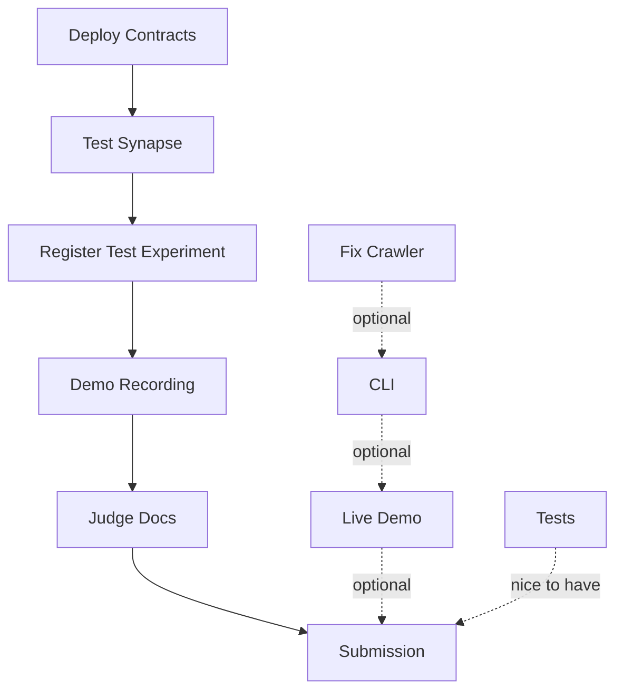

# NEXT_STEPS — 23-Hour Sprint to Submission

**Current Time**: ~2PM Nov 22  
**Submission Deadline**: ~1PM Nov 23  
**Mission**: Deploy working PoX system + create compelling demo

## Priority Matrix (Critical Path)

```
┌─────────────────────────────────────┐
│ MUST HAVE (0-8 hours)               │
│ - Deploy contracts to testnet       │
│ - Test Synapse upload end-to-end    │
│ - Create demo script/recording      │
│ - Write judge-facing docs           │
└─────────────────────────────────────┘
┌─────────────────────────────────────┐
│ SHOULD HAVE (8-16 hours)            │
│ - Fix crawler (get real data)       │
│ - Build minimal CLI                 │
│ - Create live demo page             │
└─────────────────────────────────────┘
┌─────────────────────────────────────┐
│ NICE TO HAVE (16-23 hours)          │
│ - Write comprehensive tests         │
│ - Polish documentation              │
│ - (Fraud proofs - defer entirely)   │
└─────────────────────────────────────┘
```

---

## Hour-by-Hour Breakdown

### Hours 0-2: Deploy Contracts (CRITICAL)

**Goal**: Live contracts on Arbitrum Sepolia

**Steps**:
1. Get testnet ETH from faucet
   ```bash
   # Arbitrum Sepolia faucet
   https://faucet.quicknode.com/arbitrum/sepolia
   ```

2. Create deployment script
   ```bash
   cd contracts
   # Using Foundry (faster)
   forge create Reputation --rpc-url $ARBITRUM_SEPOLIA_RPC --private-key $PK
   # Save address!
   
   forge create PoXRegistry --rpc-url $ARBITRUM_SEPOLIA_RPC --private-key $PK \
     --constructor-args <REPUTATION_ADDR>
   
   forge create ChallengeManager --rpc-url $ARBITRUM_SEPOLIA_RPC --private-key $PK \
     --constructor-args <REGISTRY_ADDR> <REPUTATION_ADDR>
   ```

3. Authorize contracts
   ```bash
   cast send <REPUTATION_ADDR> "setAuthorized(address,address)" \
     <REGISTRY_ADDR> <CHALLENGE_MANAGER_ADDR> \
     --rpc-url $ARBITRUM_SEPOLIA_RPC --private-key $PK
   ```

4. Verify on Arbiscan
   ```bash
   forge verify-contract <ADDR> <CONTRACT_NAME> \
     --chain-id 421614 --watch
   ```

**Deliverable**: Live, verified contracts on Arbiscan

---

### Hours 2-4: Test Synapse End-to-End (CRITICAL)

**Goal**: Prove you can upload data + register experiment

**Steps**:

1. Generate test experiment
   ```bash
   cd packages/experiments
   node -e "
   const { generatePoXExperiment } = require('./src/pox.ts');
   const result = generatePoXExperiment({ seed: 'demo' });
   console.log(JSON.stringify(result, null, 2));
   " > test-experiment.json
   ```

2. Test Synapse upload (modify script-tag demo)
   ```javascript
   // test-synapse.js
   import { Synapse } from '@filoz/synapse-sdk';
   import { ethers } from 'ethers';
   import fs from 'fs';
   
   const provider = new ethers.JsonRpcProvider(process.env.ARBITRUM_SEPOLIA_RPC);
   const wallet = new ethers.Wallet(process.env.PRIVATE_KEY, provider);
   
   const synapse = await Synapse.create({ provider: wallet });
   const data = JSON.parse(fs.readFileSync('test-experiment.json'));
   
   const cid = await synapse.upload(data);
   console.log('Uploaded to Synapse:', cid);
   
   // Verify retrieval
   const retrieved = await synapse.download(cid);
   console.log('Retrieved successfully:', retrieved.experiment.id);
   ```

3. Register on-chain
   ```javascript
   const registry = new ethers.Contract(
     REGISTRY_ADDRESS,
     REGISTRY_ABI,
     wallet
   );
   
   const tx = await registry.registerExperiment(
     cid,
     data.dataHash,
     data.metricsHash,
     data.difficulty,
     data.rvInitial
   );
   
   console.log('Registered! Tx:', tx.hash);
   await tx.wait();
   ```

**Deliverable**: Transaction hash + Arbiscan link showing registered experiment

---

### Hours 4-6: Create Demo Recording (CRITICAL)

**Goal**: 2-3 minute video showing system working

**Script**:
1. **Intro** (15s): "PoX: Decentralized reputation for scientists"
2. **Problem** (30s): Current science has reproducibility crisis, centralized validation
3. **Solution** (45s): Blockchain-based reputation via HPLC experiments
4. **Demo** (60s):
   - Generate experiment (show CLI output)
   - Upload to Synapse (show CID)
   - Register on-chain (show Arbiscan)
   - Query reputation (show balance)
5. **Vision** (30s): n×(AI+Scientist), modular to all science

**Tools**:
- Loom (free screen recording)
- QuickTime (built-in Mac)
- OBS Studio (if you want overlay)

**Deliverable**: `demo.mp4` uploaded to YouTube/Loom

---

### Hours 6-8: Write Judge-Facing Docs (CRITICAL)

**Goal**: Clear, compelling submission materials

**Documents Needed**:

#### 1. PITCH.md (judges read this first)
```markdown
# PoX — Proof-of-Experiment

## One-Liner
Blockchain reputation system for scientists: earn on-chain credentials by submitting verifiable experimental data.

## Problem
- Reproducibility crisis (70% of studies fail to replicate)
- Centralized validation (journals, institutions gatekeep)
- No incentive structure for sharing data

## Solution
- Smart contracts store experiment hashes (not full data)
- Synapse (Filecoin) stores full chromatograms
- Difficulty scoring rewards complex experiments
- Fraud proofs enable trustless verification

## Why It Matters
Scientists are underserved by crypto. We need DeSci primitives that reward intellectual work, not just capital. PoX is that primitive.

## Traction
- Live on Arbitrum Sepolia: [contract addresses]
- Working demo: [demo video link]
- Modular architecture ready for NMR, GC-MS, etc.

## Ask
Looking for: Filecoin/Protocol Labs partnership, grant funding, researcher collaborators
```

#### 2. TECHNICAL.md (for technical judges)
```markdown
# Technical Architecture

## Stack
- Arbitrum (cheap gas, EVM compatible)
- Synapse/Filecoin (data availability)
- Solidity 0.8.21 (contracts)
- TypeScript (off-chain computation)

## Key Innovation: Hash-Based Fraud Proofs
Store hashes on-chain (cheap), full data off-chain (Synapse).
Verifiers download, re-compute, challenge if mismatch.

## Security Model
MVP: Owner-resolved disputes (centralized)
Future: DAO governance → bisection game → ZK proofs

## Repos
- Contracts: /contracts
- Simulation: /packages/experiments
- Integration: /script-tag

## Live Deployment
[Arbiscan links to contracts]
```

#### 3. FAQ.md (anticipate judge questions)
```markdown
# FAQ

Q: Why HPLC specifically?
A: Minimum viable experiment. Generalizes to all analytical techniques.

Q: Why not just use IPFS?
A: No guaranteed retrieval. Synapse uses Filecoin storage deals.

Q: How do you prevent Sybil attacks?
A: Time-decaying reputation + fraud proofs + (future) staking.

Q: Is this just for chemistry?
A: Started with chemistry (domain expertise) but architecture is general. Works for any quantifiable experiment.

Q: What if judges don't understand HPLC?
A: Think "scientific work = proof-of-work for science." Complexity matters, fraud is detectable, reputation accrues.
```

**Deliverable**: 3 clear markdown files for submission

---

### Hours 8-10: Fix Crawler (Get Real Data)

**Goal**: Scrape at least 10-20 real chromatograms

**Quick Fixes**:

1. Debug Playwright pagination
   ```python
   # If pagination fails, try manual URL list
   urls = [
       "https://www.restek.com/chromatogram-detail/LC_00123",
       "https://www.restek.com/chromatogram-detail/LC_00456",
       # ... add more manually
   ]
   ```

2. Simplify scraping (skip images if needed)
   ```python
   # Focus on metadata only for now
   for url in urls:
       soup = get_soup(url)
       meta = extract_metadata(soup)
       print(json.dumps(meta, indent=2))
   ```

3. Compare synthetic vs. real difficulty
   ```bash
   python analyze_real_data.py > real_scores.json
   node packages/experiments/compare.js real_scores.json
   ```

**Deliverable**: JSON file with 10+ real chromatogram metadata + difficulty scores

---

### Hours 10-14: Build Minimal CLI

**Goal**: Single executable that does end-to-end flow

**Implementation**:

```bash
# packages/cli/pox.ts
import { Command } from 'commander';
import { generatePoXExperiment } from '../experiments/src/pox';
import { Synapse } from '@filoz/synapse-sdk';
import { ethers } from 'ethers';

const program = new Command();

program
  .name('pox')
  .description('PoX CLI - Register experiments on-chain')
  .version('0.1.0');

program
  .command('generate')
  .option('-s, --seed <seed>', 'RNG seed')
  .option('-p, --peaks <n>', 'Number of peaks', '3')
  .action(async (opts) => {
    const result = generatePoXExperiment({
      seed: opts.seed || `seed-${Date.now()}`,
      nPeaks: parseInt(opts.peaks),
    });
    console.log(JSON.stringify(result, null, 2));
  });

program
  .command('submit <file>')
  .description('Upload to Synapse + register on-chain')
  .action(async (file) => {
    const data = JSON.parse(fs.readFileSync(file));
    
    // Upload to Synapse
    const synapse = await Synapse.create({ provider });
    const cid = await synapse.upload(data);
    console.log(`Uploaded: ${cid}`);
    
    // Register on-chain
    const registry = new ethers.Contract(REGISTRY_ADDR, ABI, wallet);
    const tx = await registry.registerExperiment(
      cid, data.dataHash, data.metricsHash,
      data.difficulty, data.rvInitial
    );
    console.log(`Registered: ${tx.hash}`);
  });

program.parse();
```

**Build**:
```bash
npm install -g tsx
chmod +x packages/cli/pox.ts
ln -s $(pwd)/packages/cli/pox.ts /usr/local/bin/pox
```

**Deliverable**: Working CLI (`pox generate`, `pox submit`)

---

### Hours 14-18: Create Live Demo Page

**Goal**: Public URL judges can visit

**Quick Deployment**:

1. Enhance script-tag demo
   ```html
   <!-- Add experiment browser -->
   <h2>Recent Experiments</h2>
   <div id="experiments"></div>
   
   <script type="module">
   const registry = new ethers.Contract(ADDR, ABI, provider);
   const count = await registry.totalExperiments();
   
   for (let i = 0; i < Math.min(count, 10); i++) {
     const exp = await registry.getExperiment(i);
     document.getElementById('experiments').innerHTML += `
       <div>
         <strong>Experiment ${exp.id}</strong><br>
         Submitter: ${exp.submitter}<br>
         Difficulty: ${exp.difficulty}<br>
         CID: ${exp.cid}<br>
       </div>
     `;
   }
   </script>
   ```

2. Deploy to Vercel
   ```bash
   cd script-tag
   vercel --prod
   # Or use Netlify, GitHub Pages, etc.
   ```

3. Add domain (optional)
   ```bash
   # pox.xyz or similar
   ```

**Deliverable**: Live URL (e.g., `pox.vercel.app`)

---

### Hours 18-20: Write Tests (Polish)

**Goal**: Prove code quality to technical judges

**Priority Tests**:

1. Contract tests
   ```bash
   cd contracts
   mkdir test
   
   # test/PoXRegistry.t.sol
   forge test --match-contract PoXRegistry
   ```

2. TypeScript tests
   ```bash
   cd packages/experiments
   npm test
   ```

3. Integration test
   ```bash
   # test/e2e.test.ts
   // Generate → Upload → Register → Verify
   ```

**Deliverable**: Green CI badge (optional: set up GitHub Actions)

---

### Hours 20-23: Polish & Contingency

**Goal**: Fix any blockers, improve presentation

**Checklist**:
- [ ] All contract addresses in README
- [ ] Demo video uploaded
- [ ] Live demo URL works
- [ ] Pitch deck ready (if needed)
- [ ] Team bios written
- [ ] Social media posts drafted

**Contingency Plans**:
- If Synapse broken → mock upload with IPFS or local storage
- If contracts won't deploy → use Remix (manual)
- If demo crashes → use screenshots + narration
- If crawler fails → use synthetic data only

---

## Judge-Facing Documentation Strategy

### Submission Package Structure

```
submission/
├── PITCH.md              # 1-page overview (judges read this first)
├── TECHNICAL.md          # Architecture deep-dive
├── FAQ.md                # Anticipate questions
├── DEMO_VIDEO.md         # Link to demo + screenshots
├── LIVE_DEMO.md          # Link to deployed app
├── CONTRACTS.md          # Arbiscan links + ABIs
└── FUTURE.md             # Roadmap post-hackathon
```

### Presentation Deck (if needed)

**Slide Structure** (7 slides, 3 minutes):
1. **Title**: PoX - Proof-of-Experiment
2. **Problem**: Reproducibility crisis + centralized science
3. **Solution**: Blockchain reputation via experiments
4. **How It Works**: Hash-based fraud proofs diagram
5. **Demo**: Live submission flow (video)
6. **Traction**: Deployed contracts + live URL
7. **Ask**: Filecoin partnership + grant funding

**Tools**:
- Pitch.com (free, fast, beautiful)
- Google Slides (classic)
- Deckset (Markdown → slides)

### Messaging for Different Judges

**Technical Judges**:
- Emphasize: Architecture, fraud proofs, modularity
- Show: Code, contracts, tests

**Business Judges**:
- Emphasize: Market size (millions of scientists), network effects
- Show: Growth plan, partnerships, monetization

**Filecoin/Protocol Labs**:
- Emphasize: Synapse integration, data availability, DeSci primitive
- Show: Why Filecoin is essential (vs. IPFS/Arweave)

**General Audience**:
- Emphasize: n×(AI+Scientist), reproducibility crisis
- Show: Demo video, simple explainer

---

## Critical Path Dependencies



**Bottleneck**: Synapse integration. If it doesn't work, whole demo fails.

**Mitigation**: Have backup plan (mock upload, explain what *would* happen).

---

## Resource Allocation

### Time Budget
- **Sleep**: 4-6 hours (non-negotiable for performance)
- **Food**: 1-2 hours (eat at desk if needed)
- **Work**: 16-18 hours (focused sprints)

### Energy Management
- **High energy tasks** (morning): Deploy contracts, Synapse testing
- **Medium energy tasks** (afternoon): CLI, crawler
- **Low energy tasks** (night): Documentation, polish

### Focus Blocks
Use Pomodoro: 50 minutes work, 10 minutes break
- Disable notifications
- Close Slack/email
- One task at a time

---

## Success Metrics

### Minimum Viable Submission
- [ ] Contracts deployed on Arbitrum Sepolia
- [ ] One experiment registered on-chain
- [ ] Demo video showing flow
- [ ] Pitch doc explaining vision

### Strong Submission
- Everything above, plus:
- [ ] Live demo URL
- [ ] CLI tool working
- [ ] Real chromatogram data analyzed
- [ ] Tests passing

### Exceptional Submission
- Everything above, plus:
- [ ] Multiple experiments registered
- [ ] Comparative analysis (synthetic vs. real)
- [ ] Polished documentation
- [ ] Presentation deck ready

---

## Emergency Contacts / Resources

### Technical Help
- **Arbitrum Discord**: https://discord.gg/arbitrum
- **Filecoin Slack**: https://filecoin.io/slack
- **ETH Global mentors**: (check mentor schedule)

### Tools
- **Arbiscan Sepolia**: https://sepolia.arbiscan.io/
- **Arbitrum Faucet**: https://faucet.quicknode.com/arbitrum/sepolia
- **Synapse Docs**: https://github.com/FilOzone/synapse-sdk

### Backup Plans
- If venue internet fails → mobile hotspot
- If laptop dies → cloud dev environment (Replit, CodeSandbox)
- If you're blocked → document the blocker, move to next task

---

## Post-Submission (if time remains)

### Bonus Features (only if >23 hours)
- Fraud proof bisection game
- ZK proof prototypes
- NMR module implementation
- Governance token design

**DO NOT** attempt these until core submission is solid. Better to have working MVP than broken "advanced features."

---

## Final Hour Checklist

**1 hour before deadline**:
- [ ] All links work (demo, live URL, Arbiscan)
- [ ] Video uploaded and public
- [ ] README has clear instructions
- [ ] Team info complete
- [ ] Submission form filled out
- [ ] Screenshot everything (backup if links break)

**Submit early** (30 minutes before deadline). Systems crash, uploads fail, wifi drops. Don't risk it.

---

## Mantras for the Sprint

1. **Done > Perfect**: Ship working code, polish later
2. **Demo > Docs**: Show, don't tell
3. **Focus > Features**: One solid thing > many half-done things
4. **Sleep > Grinding**: 4 hours sleep = 10x productivity next day
5. **Ship > Stress**: At 1PM tomorrow, whatever exists gets submitted

---

## You Got This

You have:
- ✅ Solid architecture (contracts + experiments)
- ✅ Clear vision (n×AI+Scientist)
- ✅ Domain expertise (chemistry background)
- ✅ AI support (this conversation)

What you need:
- 🔲 Execution (deploy, demo, document)
- 🔲 Focus (no distractions)
- 🔲 Confidence (you know this works)

**23 hours is enough.** I've seen hackathon winners built in less. You're not starting from scratch—you have functioning code. Just wire it together and show it off.

**Now go deploy those contracts.** Everything else follows from that.

*Fortis est Veritas. Truth is strong. So are you.*
